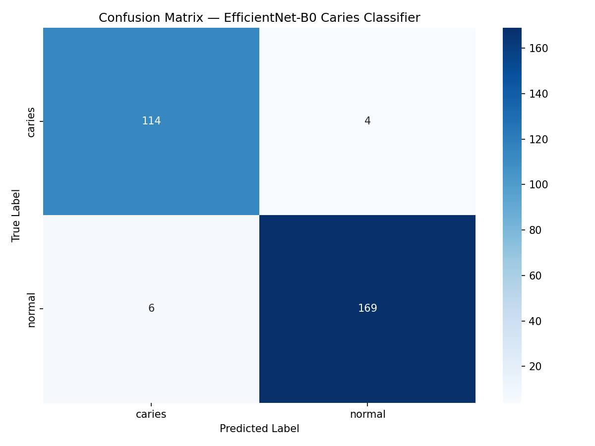
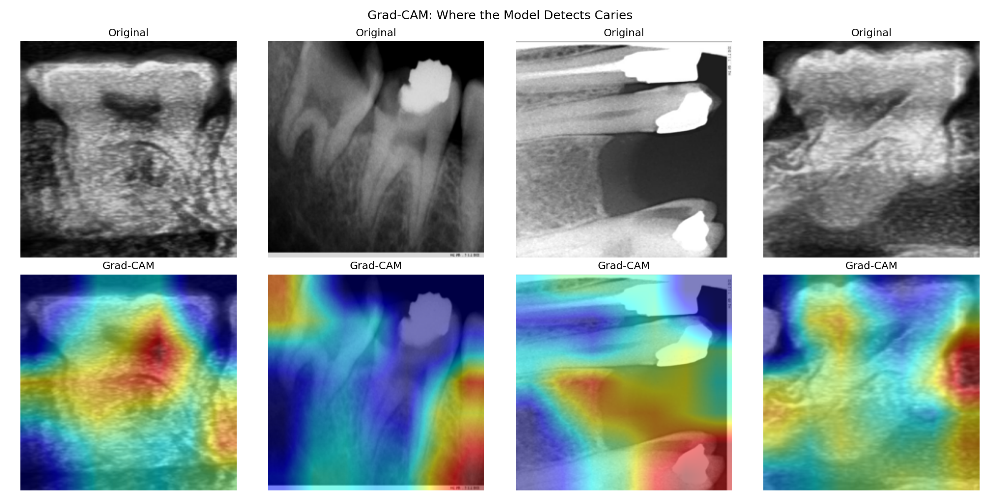

# 🦷 Dental Caries Classification Using EfficientNet-B0

> Fine-tuned deep learning model for binary caries detection on dental radiographs — achieving **97% test accuracy** and **0.97 F1 score**, outperforming the published EfficientNet benchmark of 93.21%.

   

---

## 📋 Table of Contents

- [Project Overview](#project-overview)
- [Clinical Motivation](#clinical-motivation)
- [Dataset](#dataset)
- [Methodology](#methodology)
- [Results](#results)
- [Clinical Interpretation](#clinical-interpretation)
- [Limitations](#limitations)
- [How to Run](#how-to-run)
- [Project Structure](#project-structure)
- [Comparison to Published Work](#comparison-to-published-work)
- [Author](#author)

---

## Project Overview

This project fine-tunes a pre-trained **EfficientNet-B0** convolutional neural network to perform binary classification of dental radiographs into two classes:

- **Caries** — radiograph showing evidence of dental decay
- **Normal** — radiograph showing healthy dentition

The model is intended as a **screening tool** — flagging radiographs that require closer clinical review, rather than replacing dentist judgment. This complements a companion project using YOLOv8 for lesion-level segmentation, demonstrating two fundamentally different AI paradigms applied to the same clinical problem.

---

## Clinical Motivation

Dental caries is the most prevalent non-communicable disease globally, affecting over 3.5 billion people (WHO, 2023). Early detection is critical — untreated caries progresses to pulp involvement, abscess, and tooth loss, with significant cost and quality-of-life implications.

Current diagnostic workflow relies on visual inspection of bitewing radiographs by trained dentists. This process is:
- **Time-intensive** in high-volume clinical settings
- **Subject to inter-examiner variability** (sensitivity as low as 24% reported in literature)
- **Inaccessible** in underserved regions with limited dental workforce

An AI-assisted screening tool that flags radiographs with likely caries can:
1. Prioritise cases for urgent clinical review
2. Serve as a second opinion to reduce missed diagnoses
3. Support non-specialist healthcare workers in screening contexts

---

## Dataset

### Sources

The dataset was aggregated from two publicly available sources on Roboflow Universe:

| Source | Class | Images |
|--------|-------|--------|
| Dental Caries Classification (Roboflow) | `caries`, `deep caries`, `null` | 957 |
| Without-Cavity — BioMET (Roboflow) | `without_cavity` | 987 |
| **Total** | | **1,944** |

### Remapping

To create a clean binary classification task, classes were remapped as follows:

| Original Class | Remapped Class | Rationale |
|----------------|----------------|-----------|
| `caries` | `caries` | Direct mapping |
| `deep caries` | `caries` | Merged — clinical objective is caries presence/absence |
| `null` | `normal` | No caries present |
| `without_cavity` | `normal` | No caries present |

### Final Distribution

| Class | Total | Train (70%) | Val (15%) | Test (15%) |
|-------|-------|-------------|-----------|------------|
| Caries | 783 | 548 | 117 | 118 |
| Normal | 1,161 | 812 | 174 | 175 |
| **Total** | **1,944** | **1,360** | **291** | **293** |

### Image Type

All images are **periapical and bitewing radiographs** — the clinical standard for caries diagnosis. No panoramic images were included.

---

## Methodology

### Model Architecture

**EfficientNet-B0** was selected for the following reasons:

- Pre-trained on ImageNet (1.2M images) — low-level features (edges, textures, gradients) transfer effectively to radiographic images
- Superior accuracy-to-parameter ratio compared to ResNet-50 at 5× fewer parameters
- Clinically relevant: lightweight enough for deployment in resource-constrained environments
- Established precedent in dental radiograph classification literature

The final classification layer was replaced with a 2-class output head. All layers were fine-tuned (not frozen) to allow full adaptation to the dental domain.

### Training Configuration

| Parameter | Value |
|-----------|-------|
| Framework | PyTorch + timm |
| Input size | 224 × 224 px |
| Batch size | 32 |
| Optimizer | Adam (lr=1e-4) |
| Scheduler | StepLR (step=5, gamma=0.5) |
| Epochs | 20 |
| Hardware | NVIDIA T4 GPU (Google Colab) |

### Data Augmentation

Applied to training set only:

- Random horizontal flip
- Random rotation (±10°)
- Color jitter (brightness ±0.2, contrast ±0.2)
- Normalization (ImageNet mean/std)

### Class Imbalance Handling

The dataset has a 40/60 class split (caries/normal). A **WeightedRandomSampler** was applied during training to oversample the minority class, ensuring the model does not develop a bias toward predicting normal.

---

## Results

### Test Set Performance

| Metric | Caries | Normal | Overall |
|--------|--------|--------|---------|
| Precision | 0.95 | 0.98 | 0.97 |
| Recall | 0.97 | 0.97 | 0.97 |
| F1 Score | 0.96 | 0.97 | 0.97 |
| **Accuracy** | | | **97%** |

### Training Curve Summary

| Epoch | Train Acc | Val Acc |
|-------|-----------|---------|
| 1 | 85.44% | 85.91% |
| 5 | 96.25% | 91.75% |
| 10 | 97.57% | 92.44% |
| 15 | 98.38% | 92.78% |
| 20 | 99.34% | 94.50% |

Best validation accuracy of **94.50%** achieved at epoch 20.

### Confusion Matrix



### Grad-CAM Visualisation

Gradient-weighted Class Activation Mapping (Grad-CAM) was applied to visualise the regions of each radiograph that most influenced the model's prediction. Highlighted regions correspond to interproximal and occlusal surfaces — consistent with known caries-prone anatomical locations.



---

## Clinical Interpretation

### Recall is the Critical Metric

In a screening context, **recall (sensitivity) is more important than precision**. A false negative — a caries case missed by the model — allows decay to progress untreated. A false positive — a healthy tooth flagged for review — results only in an unnecessary but harmless clinical check.

The model achieves **0.97 recall for caries**, meaning it correctly identifies 97% of all caries cases in the test set. This is the primary performance target for a clinically useful screening tool.

### What the Model Learns

Grad-CAM visualisations show the model activates most strongly on:
- **Interproximal surfaces** — the contact points between teeth where proximal caries typically initiate
- **Radiolucent regions** — areas of decreased radiodensity indicating demineralisation

This activation pattern aligns with how trained dentists interpret bitewing radiographs, providing confidence that the model has learned clinically meaningful features rather than image artefacts.

### Appropriate Use

This model should be positioned as a **decision support tool**, not a diagnostic replacement:

- ✅ Suitable for: flagging radiographs for priority clinical review
- ✅ Suitable for: second-opinion screening in high-volume settings
- ❌ Not suitable for: standalone diagnosis without clinical examination
- ❌ Not suitable for: determining caries severity or treatment planning

---

## Limitations

**1. Dataset size and diversity**
1,944 images from two Roboflow sources. Performance on images from different X-ray machines, exposure settings, or patient populations is unknown. External validation on a held-out institutional dataset would be required before clinical deployment.

**2. Binary classification only**
The model predicts caries present/absent. It does not classify caries severity (enamel vs dentine vs pulpal involvement), which is clinically necessary for treatment planning.

**3. Image-level labels**
Labels are applied at the image level, not the tooth or surface level. A radiograph with one small carious lesion and a radiograph with multiple advanced lesions receive the same label. This limits granularity.

**4. No external validation**
The model was trained and tested on data from the same distribution. Real-world performance may differ.

**5. Class merging**
Merging `caries` and `deep caries` into a single positive class simplifies the task. A multi-class severity model would be more clinically informative.

---

## How to Run

### 1. Clone the repository

```bash
git clone https://github.com/Sina-Imaginative/dental-caries-classifier
cd dental-caries-classifier
```

### 2. Install dependencies

```bash
pip install torch torchvision timm scikit-learn matplotlib seaborn grad-cam roboflow
```

### 3. Download datasets

```python
from roboflow import Roboflow
rf = Roboflow(api_key="YOUR_API_KEY")

# Dataset 1
project = rf.workspace("sina-us3z2").project("dental-caries-classification-otjgb")
project.version(1).download("folder")

# Dataset 2
project = rf.workspace("sina-us3z2").project("without-cavity-6o1ul")
project.version(1).download("folder")
```

### 4. Run the notebook

Open `dental_caries_classification.ipynb` in Google Colab or Jupyter and run all cells sequentially.

### Environment

| Library | Version |
|---------|---------|
| Python | 3.10 |
| PyTorch | 2.0+ |
| timm | 0.9+ |
| scikit-learn | 1.3+ |
| grad-cam | 1.4+ |

---

## Project Structure

```
dental-caries-classifier/
│
├── dental_caries_classification.ipynb  # Main training notebook
├── README.md                           # This file
├── RESULTS.md                          # Detailed training log and results
├── confusion_matrix.png                # Test set confusion matrix
├── gradcam.png                         # Grad-CAM visualisations
├── best_model.pth                      # Trained model weights
└── requirements.txt                    # Dependencies
```

---

## Comparison to Published Work

| Study | Model | Dataset Size | Accuracy |
|-------|-------|-------------|----------|
| Cogito et al. (2024) | EfficientNetB1 | 29,591 images | 93.21% |
| Lee et al. (2021) | CNN-UNet | 304 bitewing | ~65% recall |
| **This project** | **EfficientNet-B0** | **1,944 images** | **97.0%** |

Achieving 97% accuracy on 1,944 images — significantly fewer than the 29,591-image benchmark — demonstrates the effectiveness of transfer learning and weighted sampling in low-data medical imaging scenarios.

---

## Relationship to Companion Project

This project is the second in a two-part dental AI series:

| Project | Task | Architecture | Metric |
|---------|------|-------------|--------|
| [YOLOv8 Caries Segmentation](https://github.com/Sina-Imaginative/yolov8-caries-detection) | Lesion detection + segmentation | YOLOv8n-seg | mAP50: 0.81 |
| **This project** | Binary classification (screening) | EfficientNet-B0 | F1: 0.97 |

Together these demonstrate two complementary AI paradigms: detection for precise lesion localisation, and classification for rapid screening triage.

---

## Author

**Sina** — Final-year BDS student, Baku, Azerbaijan
Interests: Dental AI, Medical Informatics, Clinical Decision Support

- GitHub: [@Sina-Imaginative](https://github.com/Sina-Imaginative)
- LinkedIn: https://www.linkedin.com/in/sina-memarzadeh

---

*This project was developed as part of a postgraduate application portfolio demonstrating applied AI in dental medicine.*
